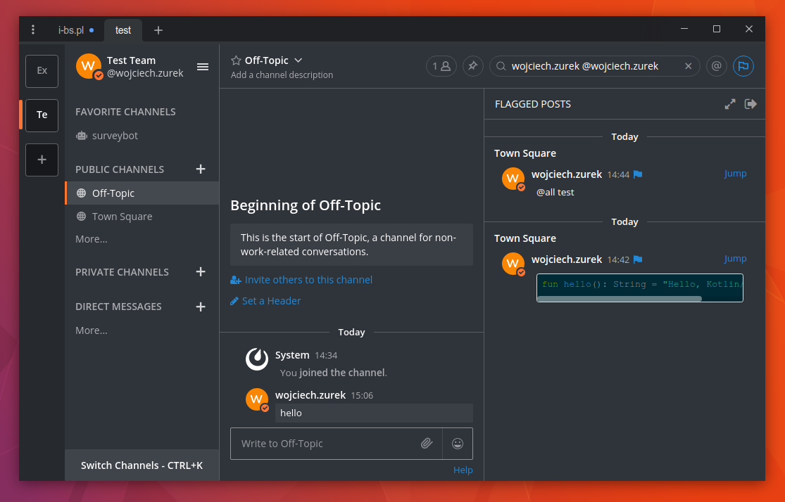

# The Hummingbird Mattermost Theme

* Open Mattermost
* Account Settings
* Display
* Custom Theme
* Paste the code

```json
{"sidebarBg":"#2f343b","sidebarText":"#ffffff","sidebarUnreadText":"#ffffff","sidebarTextHoverBg":"#fd7532","sidebarTextActiveBorder":"#fd7532","sidebarTextActiveColor":"#ffffff","sidebarHeaderBg":"#2f343b","sidebarHeaderTextColor":"#ffffff","onlineIndicator":"#fd7532","awayIndicator":"#e0b333","dndIndicator":"#f74343","mentionBj":"#ffffff","mentionColor":"#ffffff","centerChannelBg":"#2f343b","centerChannelColor":"#ffffff","newMessageSeparator":"#f80","linkColor":"#2389d7","buttonBg":"#26a970","buttonColor":"#ffffff","errorTextColor":"#fd5960","mentionHighlightBg":"#ff8800","mentionHighlightLink":"#ffffff","codeTheme":"solarized-dark","mentionBg":"#fd7532"}
```

* Save

# Screenshot


